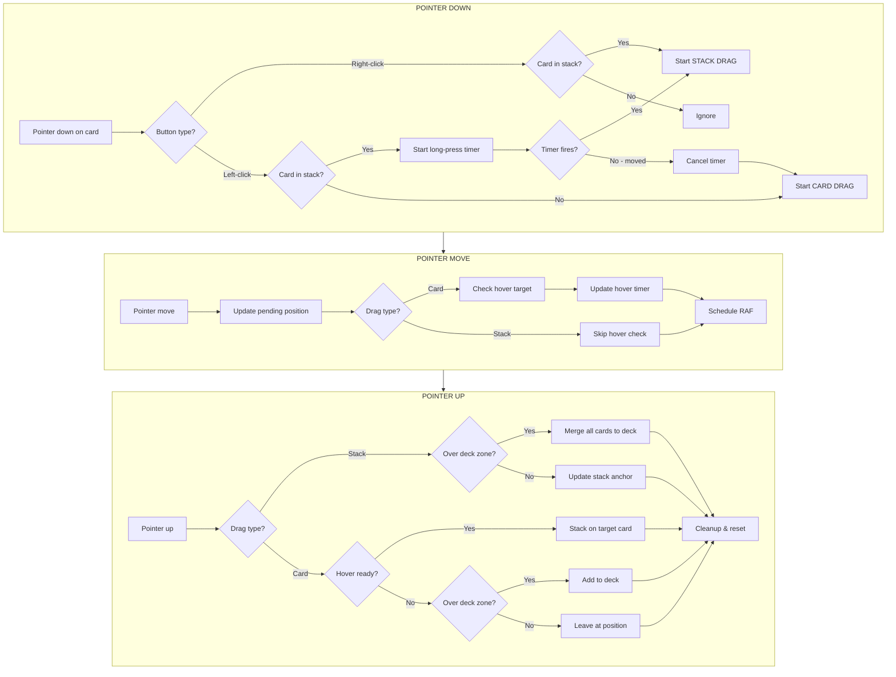

# cardz

A card manipulation sandbox with drag-and-drop interactions, stacking mechanics, and deck management.

---

## Entities

### Card

A single playing card that can be moved, stacked, and organized.

| Property   | Type             | Description                                 |
| ---------- | ---------------- | ------------------------------------------- |
| `id`       | `number`         | Unique identifier                           |
| `col`      | `number`         | Sprite column in tilemap (0-4)              |
| `row`      | `number`         | Sprite row in tilemap (0-4)                 |
| `x`        | `number`         | X position on canvas (pixels)               |
| `y`        | `number`         | Y position on canvas (pixels)               |
| `z`        | `number`         | Base z-index for rendering order            |
| `stackId`  | `number \| null` | ID of stack this card belongs to, or `null` |
| `isInDeck` | `boolean`        | Whether card is part of any stack           |
| `faceUp`   | `boolean`        | Whether card face is visible                |
| `inHand`   | `boolean`        | Whether card is in player's hand            |

### Stack

A collection of cards sharing a common anchor position.

| Property  | Type               | Description                              |
| --------- | ------------------ | ---------------------------------------- |
| `id`      | `number`           | Unique identifier                        |
| `cardIds` | `number[]`         | Ordered list of card IDs (bottom to top) |
| `anchorX` | `number`           | X position of stack anchor               |
| `anchorY` | `number`           | Y position of stack anchor               |
| `kind`    | `'zone' \| 'free'` | Stack type (see below)                   |

**Stack Kinds:**

- `zone` — Anchored to a UI element (e.g., deck zone). Position updates when UI moves.
- `free` — Anchored to canvas coordinates. Created when cards are stacked freely.

### Canvas

The play area where cards exist and can be manipulated.

| Property | Type     | Description             |
| -------- | -------- | ----------------------- |
| `width`  | `number` | Canvas width in pixels  |
| `height` | `number` | Canvas height in pixels |

### Deck Zone

A designated drop target for organizing cards.

| Property | Type     | Description                 |
| -------- | -------- | --------------------------- |
| `x`      | `number` | Position relative to canvas |
| `y`      | `number` | Position relative to canvas |
| `width`  | `number` | Hit area width              |
| `height` | `number` | Hit area height             |

### Hand

The player's personal hand zone, displayed at the bottom of the screen.

| Property  | Type       | Description                            |
| --------- | ---------- | -------------------------------------- |
| `cardIds` | `number[]` | Ordered list of card IDs (left→right)  |
| Position  | Fixed      | Centered at bottom of canvas           |
| Layout    | Horizontal | Cards overlap with `HAND_CARD_OVERLAP` |

**Hand Behavior:**

- Cards in hand are always face-up to the player
- Cards removed from stacks/selection when added to hand
- Drag card out of hand zone to place on canvas

---

## Interactions

### Input Methods

| Action              | Mouse                   | Touch                   | Result                        |
| ------------------- | ----------------------- | ----------------------- | ----------------------------- |
| **Move Card**       | Left-click + drag       | Tap + drag              | Drag single card              |
| **Move Stack**      | Right-click + drag      | Long press + drag       | Drag entire stack             |
| **Create Stack**    | Hover 250ms + release   | Hover 250ms + release   | Form stack at target          |
| **Add to Stack**    | Drop on stack           | Drop on stack           | Instant add to top            |
| **Merge Stacks**    | Drop stack on stack     | Drop stack on stack     | Combine stacks                |
| **Flip Card**       | Double-click            | Double-tap              | Toggle face up/down           |
| **Flip Stack**      | Double-click (stacked)  | Double-tap (stacked)    | Toggle all in stack           |
| **Toggle Select**   | Ctrl+click              | Two-finger tap          | Add/remove from selection     |
| **Move Selection**  | Drag any selected card  | Drag any selected card  | Move all selected together    |
| **Clear Selection** | Click unselected/canvas | Tap unselected/canvas   | Deselect all                  |
| **Shake to Stack**  | Shake selection rapidly | Shake selection rapidly | Combine selection, keep held  |
| **Shuffle Stack**   | Shake held stack        | Shake held stack        | Randomize card order          |
| **Add to Hand**     | Drop card on hand zone  | Drop card on hand zone  | Card moves to player's hand   |
| **Play from Hand**  | Drag card out of hand   | Drag card out of hand   | Card placed on canvas         |
| **Shuffle Stack**   | Shake held stack        | Shake held stack        | Randomize card order in stack |

> **Note:** Multi-select only works on free cards (not cards in stacks).

### Card → Canvas

| Action   | Trigger              | Result                                       |
| -------- | -------------------- | -------------------------------------------- |
| **Drag** | Pointer down + move  | Card follows pointer, z-index elevated       |
| **Drop** | Pointer up on canvas | Card stays at drop position, z-index updated |

### Card → Card

| Action          | Trigger                                                  | Result                                       |
| --------------- | -------------------------------------------------------- | -------------------------------------------- |
| **Hover Stack** | Hold card over another card for `STACK_HOVER_MS` (250ms) | Target card shows stack indicator            |
| **Stack**       | Release while hover-ready                                | Cards form a `free` stack at target position |

### Card → Stack

| Action           | Trigger                        | Result                                       |
| ---------------- | ------------------------------ | -------------------------------------------- |
| **Pull Top**     | Left-click/tap + drag top card | Card removed from stack, becomes free        |
| **Pull Middle**  | Drag card not on top           | Blocked — only top card can be pulled        |
| **Add to Stack** | Release card over stacked card | Card added to top instantly (no hover delay) |

### Card → Deck Zone

| Action          | Trigger                     | Result                                       |
| --------------- | --------------------------- | -------------------------------------------- |
| **Add to Deck** | Release card over deck zone | Card added to deck stack (creates if needed) |

### Stack → Canvas

| Action         | Trigger                                                       | Result                                |
| -------------- | ------------------------------------------------------------- | ------------------------------------- |
| **Drag Stack** | Right-click + drag (mouse) OR long press 500ms + drag (touch) | Entire stack follows pointer          |
| **Drop Stack** | Release on canvas                                             | Stack anchor updated to drop position |

### Stack → Deck Zone

| Action            | Trigger                      | Result                                |
| ----------------- | ---------------------------- | ------------------------------------- |
| **Merge to Deck** | Release stack over deck zone | All cards in stack move to deck stack |

### Stack → Stack

| Action           | Trigger                          | Result                                |
| ---------------- | -------------------------------- | ------------------------------------- |
| **Merge Stacks** | Drop stack on another stack/card | Source stack merges into target stack |
| **Hover Merge**  | Hold stack over card/stack 250ms | Target shows stack indicator          |

---

## Z-Index Hierarchy

Cards are rendered with the following z-index priority (highest on top):

| Priority | Condition             | Z-Index Range               |
| -------- | --------------------- | --------------------------- |
| 1        | Dragging stack        | `2000 + pos`                |
| 2        | Actively dragged card | `1900`                      |
| 3        | Card in stack         | `1000 + stackIdx*100 + pos` |
| 4        | Free card             | `10 + card.z`               |

---

## Constants

| Name                | Value | Description                                   |
| ------------------- | ----- | --------------------------------------------- |
| `CARD_W`            | `42`  | Card width in pixels                          |
| `CARD_H`            | `60`  | Card height in pixels                         |
| `STACK_HOVER_MS`    | `250` | Time to hover before stack-ready (ms)         |
| `LONG_PRESS_MS`     | `500` | Time to hold before stack drag initiates (ms) |
| `STACK_OFFSET_X`    | `0`   | Horizontal offset per card in stack (px)      |
| `STACK_OFFSET_Y`    | `-1`  | Vertical offset per card in stack (px)        |
| `CARD_BACK_COL`     | `13`  | Tilemap column for card back sprite           |
| `CARD_BACK_ROW`     | `1`   | Tilemap row for card back sprite              |
| `SHAKE_THRESHOLD`   | `15`  | Min movement (px) to register direction       |
| `SHAKE_REVERSALS`   | `4`   | Direction changes needed to trigger shake     |
| `SHAKE_WINDOW_MS`   | `500` | Time window for shake detection (ms)          |
| `HAND_CARD_OVERLAP` | `28`  | Horizontal overlap between cards in hand (px) |
| `HAND_PADDING`      | `16`  | Padding around hand zone (px)                 |

---

## Visual States

### Card States

| State        | Class           | Visual                                        |
| ------------ | --------------- | --------------------------------------------- |
| Default      | `.card`         | Drop shadow, grab cursor                      |
| Dragging     | `.dragging`     | Grabbing cursor, elevated z-index             |
| In Stack     | `.in-deck`      | Part of a stack                               |
| Stack Target | `.stack-target` | Yellow outline + glow (hover-ready indicator) |
| Face Down    | `.face-down`    | Shows card back sprite                        |
| Selected     | `.selected`     | Blue outline + glow                           |

---

## Event Flow

---

## Future Considerations

- [ ] **Shuffle** — Randomize card order in a stack
- [ ] **Deal** — Animate cards from deck to positions
- [ ] **Flip** — Show card face/back
- [ ] **Fan** — Spread stack for visibility
- [ ] **Multi-select** — Drag multiple free cards
- [ ] **Snap zones** — Predefined drop areas with rules
- [ ] **Undo/Redo** — Action history
